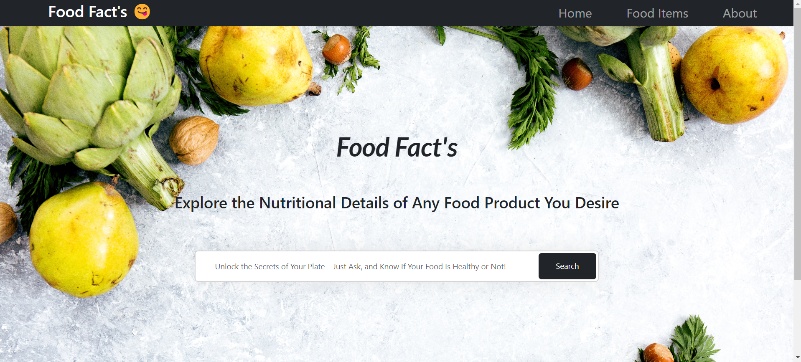
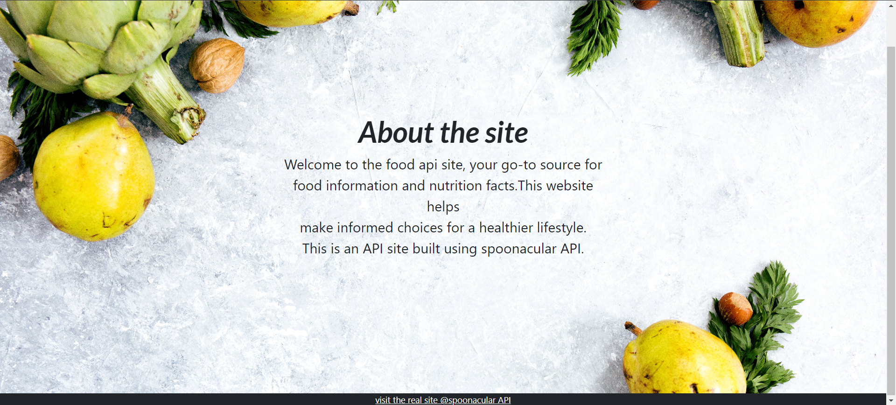
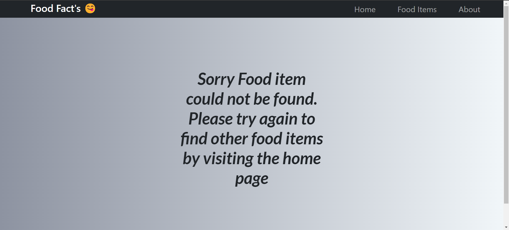
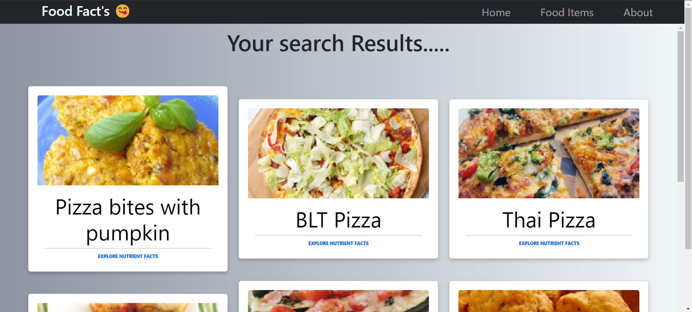
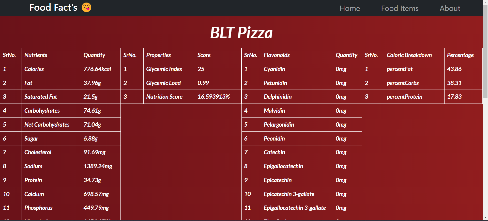

# Restful API-Driven Nutritional Facts Website 🌐

## Overview 📋

The website interacts with the Spoonacular API through HTTP requests to retrieve a diverse range of food types, displaying them on the screen. Users can seamlessly select their preferred food item to access in-depth nutritional information, leveraging additional HTTP requests for fetching specific nutritional data. 🍎🍲

## Features ✨

- Responsive design with Bootstrap for a seamless experience on different devices. 📱💻
- Explore comprehensive nutritional details for a diverse array of food items and discover healthier food choices. 🥦🍓

## Requirements 🛠️

- Python 3.x 🐍
- Flask 🌶️
- Bootstrap 🌐
- spoonacular API ([Documentation](https://spoonacular.com/food-api/docs)) 🥄
- requests 📡

### Note: Registration on the Spoonacular site is required for API access. 📝

## Working of Website 🖥️

### Home Page 🏠:
 

### About Page ℹ️:
 

### Example Page 💡:
 

### Item not found Page ❌:
 

### Result Page 📊:
 

### Nutrients Page 🍽️:
 
